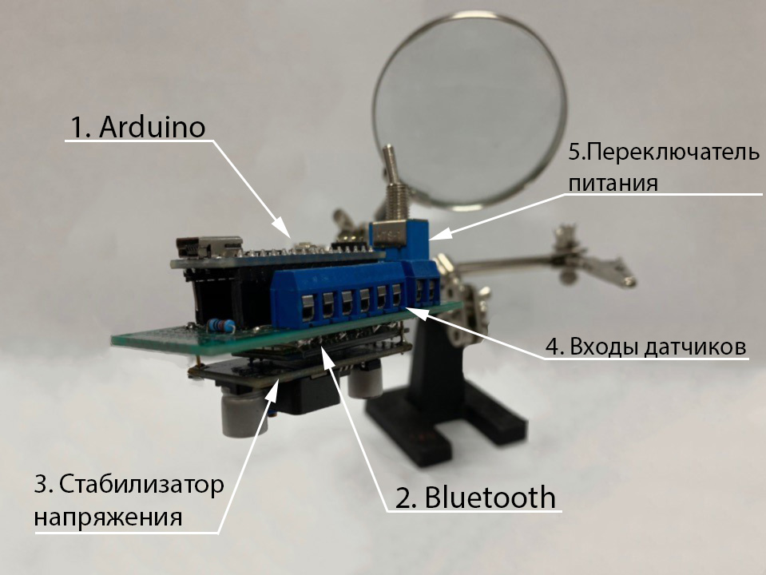
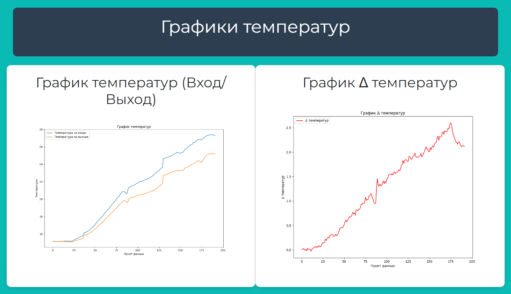

# Внедрение электронной платы в систему охлаждения электромотоцикла

**Описание**

Электронная плата разработана для контроля температуры электродвигателя на мотоцикле класса SmartMoto. Этап проектирования состоял из следующих этапов:

- Проведение термодинамических расчетов, подбор комплектующих.
- Написание программы на Arduino.
- Разработка электронной платы.
- Натурные испытания на динамометрическом стенде.

Система состроит из двух термисторов (на входе и выходе системы охлаждения), расходомера и платой в герметичном корпусе. Плата считывает температуру на входе и выходе системы, автоматически активизирует насос в заданном диапазоне температур и отправляет данные в Excel таблицу.

Из Excel таблицы данные загружаются в базу данных PostgreSQL и затем отображаются на веб-странице, созданной на фреймворке Django, в виде графиков с использованием библиотеки matplotlib. 

**Скришноты**






**Как установить**

```bash
py -m venv venv
source venv/Scripts/activate
pip intall -r requirements.txt
```

Подключение комплектующих:
- Подключите первый термистор к аналоговому пину A0 и к резистору 10 кОм, другим концом резистора к GND.
- Подключите второй термистор к аналоговому пину A1 и к резистору 10 кОм, другим концом резистора к GND.
- Подключите выход датчика потока к цифровому пину 2.

Загрузка программы:
- Откройте Arduino IDE и запустите файл `cooling_system.ino`.
- Подключите Arduino к компьютеру с помощью USB-кабеля.
- Выберите правильную плату и порт в меню Tools -> Board и Port.
- Нажмите на кнопку Upload, чтобы загрузить скетч на Arduino.


